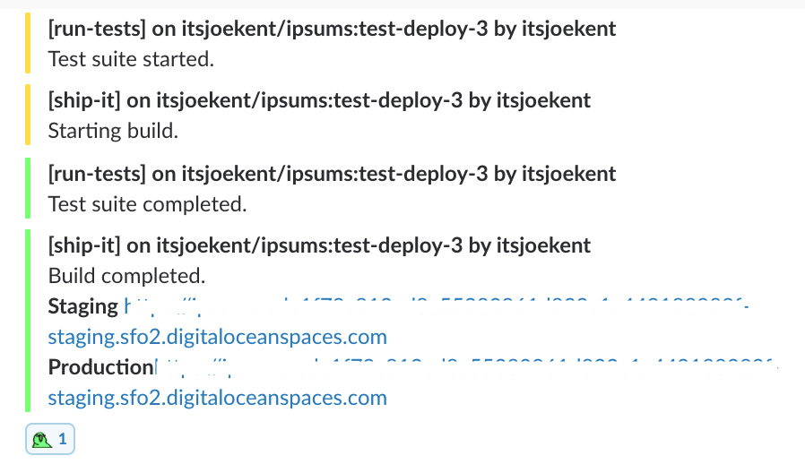

# rebuild

_Rebuild the single-page app & serverless CI/CD experience!_

Set of Github actions to test & deploy SPA's to S3 storage, Lambda functions & Cloudflare workers. Includes slack notifications for all build & test runs.



Drop these Github actions into any SPA repositories workflow to get started. If you're starting a new repository, create a workflow file at the following path in your project `.github/main.workflow`

## run-tests

Checks if the attached repository has a `ci:test` command defined in its `package.json`. Updates the pull request with test results and posts a summary to Slack.

**Workflow**

```
workflow "Test most recent commit" {
  on = "push"
  resolves = ["Test Container"]
}

action "Test Container" {
  uses = "itsjoekent/rebuild/run-tests@master"
  secrets = [
    "GITHUB_TOKEN",
  ]
}
```

The following secrets are required after applying your workflow,

- `INCOMING_SLACK` _Optional_ (Incoming Webhook URL for a Slack application)

Additionally, any environment variables configured in your workflow with the `REBUILD_` prefix will be written to an `.env` file in the container before the test process.

## ship-it

Creates a single page app deployment for every commit against staging and production environments. Deployments are identified by the repository name and commit hash. Links to deployments for both environments are placed in the pull request and posted to Slack.

The 'ship-it' action checks if you have a `ci:build` command defined in your `package.json` and expects that your build process places the resulting distribution in a `build` folder in the project root.

```
workflow "Deploy most recent commit" {
  on = "push"
  resolves = ["Ship It"]
}

action "Ship It" {
  uses = "itsjoekent/rebuild/ship-it@master"
  secrets = [
    "GITHUB_TOKEN",
  ]
}
```

The following secrets are required after applying your workflow,

- `STORAGE_ENDPOINT`
- `AWS_ACCESS_KEY_ID`
- `AWS_SECRET_ACCESS_KEY`
- `INCOMING_SLACK` _Optional_ (Incoming Webhook URL for a Slack application)

Additionally, any environment variables with the following naming prefixes will be written to an `.env` file before the build process for each environment.

- `REBUILD_${YOUR_KEY_HERE}`. Applies to both both staging & production builds.
- `REBUILD_STAGING_${YOUR_KEY_HERE}`. Applies to staging builds only.
- `REBUILD_PRODUCTION_${YOUR_KEY_HERE}`. Applies to production builds only.
